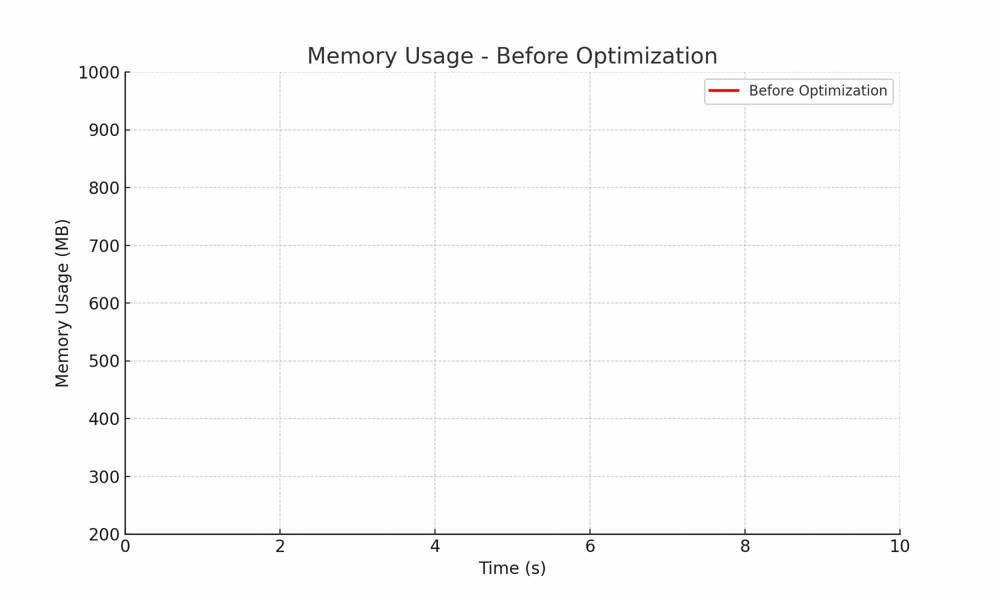
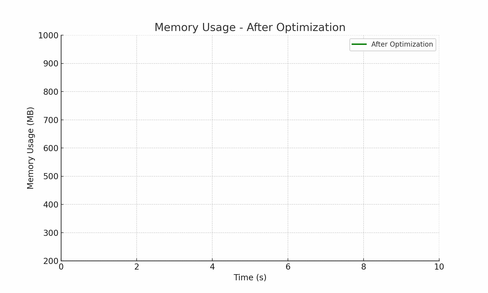
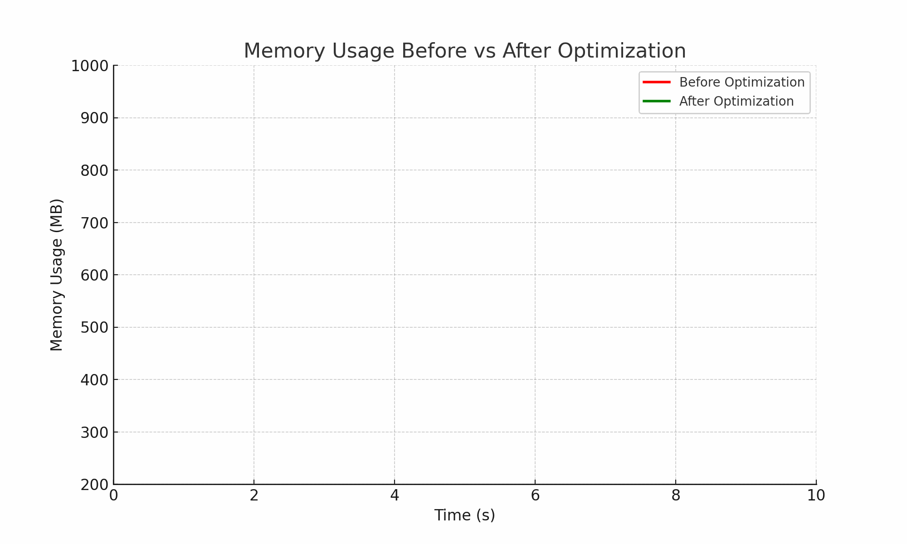

# 👋 Hi, I'm Hadi Sharifzadeh Bajgiran  

**Full-Stack Developer (.NET, Angular)**  
Remote | Open to Sponsorship (Relocation) | EU-focused (Germany/Netherlands)  

📧 Email: [hadi.sharifzadeh1378@gmail.com](mailto:hadi.sharifzadeh1378@gmail.com)  
🔗 LinkedIn: [linkedin.com/in/hadi-sharifzadeh-21b884256](https://linkedin.com/in/hadi-sharifzadeh-21b884256)  

---

## 💡 Professional Summary  

Full-stack developer specialized in **.NET** and **Angular** with hands-on experience in **RESTful API design**, **microservices**, and **DDD**.  
Focused on **clean code** and **production reliability**. Skilled in performance and memory optimization, automated testing, and building notification services (**WhatsApp/Email**).  
Comfortable with inter-service communication, **RabbitMQ**, **Redis**, and Agile teamwork across **B2B** and **B2C** projects.  

---

## 🛠 Core Skills  

- **Backend:** .NET / ASP.NET (Web API), RESTful API design  
- **Frontend:** Angular  
- **Architecture:** Microservices, Domain-Driven Design (DDD), SOLID, Clean Code  
- **Messaging & Caching:** RabbitMQ, Redis  
- **Quality:** Automated testing (unit/integration), code review  
- **Security:** Authentication/Authorization best practices  
- **Process:** Agile/Scrum, task breakdown and estimation  

---

## 💼 Experience  

### Full-Stack Developer — Utravs *(2 years | Present)*  
- Built and maintained **B2B and B2C modules** with .NET and Angular; ensured robust server-client integration.  
- Optimized slow microservices, improving performance and reducing memory usage.  
- Introduced **automated tests** to raise coverage and prevent regressions.  
- Implemented and optimized **notification services** supporting WhatsApp and Email delivery.  
- Championed **Clean Code** and **SOLID practices** to improve maintainability.  

---

### Full-Stack Developer — Novin Pardaz (Financial) *(1 year)*  
- Delivered backend and frontend features for **financial and admin workflows**.  
- Built automated **Telegram messaging** that sent messages directly from user accounts (non-bot).  
- Designed RESTful APIs and integrated them with Angular; refactored code for clarity and maintainability.  

---

### Backend Developer — Game Development Company *(2 years)*  
- Implemented backend services and communication APIs for game operations.  
- Contributed to **microservices** and **domain separation**; improved observability and production stability.  

---

## 🎓 Education  

- **BSc in Computer Science**  

---

## 🌍 Work Preferences  

- Remote | Open to relocation with sponsorship (**EU Blue Card friendly profile**)  

---

## 🚀 Performance Improvements  

Here is a visualization of my work on **memory optimization and performance improvements**:  

### 🔴 Before Optimization  
  

### 🟢 After Optimization  
  

### 📊 Comparison (Before vs After)  
  

> Memory consumption reduced significantly and response time improved.  

---

## 🔑 Keywords (ATS-Friendly)  

`.NET, ASP.NET, Angular, RESTful API, Microservices, DDD, Clean Code, SOLID, Redis, RabbitMQ, Automated Testing, WhatsApp, Email, Telegram, B2B, B2C`  
